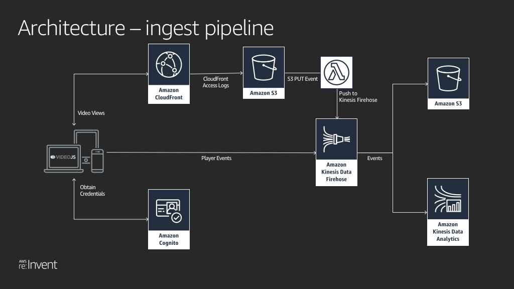
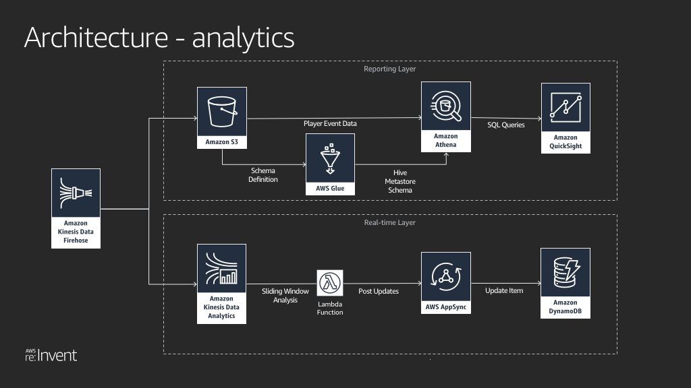
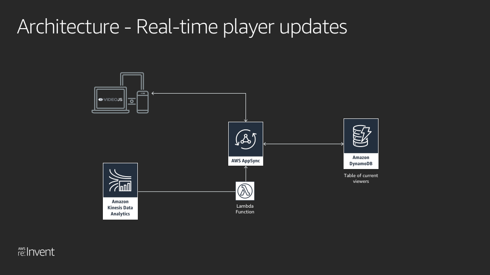

# AWS Streaming Media Analytics

AWS Streaming Media Analytics is a serverless end-to-end solution for analyzing the video streaming experience

- [AWS Streaming Media Analytics](#AWS-Streaming-Media-Analytics)
  - [How to launch the CloudFormation template](#How-to-launch-the-CloudFormation-template)
  - [Reinvent Workshop](#Reinvent-Workshop)
  - [Solution Architecture](#Solution-Architecture)
  - [How to customize and create your own CloudFormation template.](#How-to-customize-and-create-your-own-CloudFormation-template)
  - [JavaScript Video Player Setup](#JavaScript-Video-Player-Setup)
  - [License Summary](#License-Summary)

A workshop walking through the setup process is located here. [Workshop - Reinvent 2018](workshop/WORKSHOP.md)

## How to launch the CloudFormation template

Prior to deploying the OTT streaming platform, first ensure you are logged in to your AWS account for use in this workshop. To sign in to the AWS Management Console, open https://aws.amazon.com and click on the My Account->AWS Management Console link in the top right corner of the page.

This CloudFormation template deploys an example OTT streaming platform in to your AWS account. The deployed environment includes a static website hosted on S3 with sample videos, Kinesis Data Firehose endpoints to accept and process streaming log data and a real-time log analysis application built on Kinesis Analytics, DynamoDB and AppSync.

1. To deploy the CloudFormation template, click on the following link:
   

1. The CloudFormation Management Console will load with the template URL pre-filled as a Amazon S3 URL. Click the orange Next button located in the bottom right corner of the console to configure the deployment.

2. By default we have set a stack name of mediaqos. There is no need to change this and we refer to this name throughout the guide when identifying resources. If you do decide to change the stack name, please ensure you only use lower-case letters and digits, and keep the name under 12 characters. The stack name is used to name resources throughout the workshop. Keep the name handy as you will need it from time to time to locate resources deployed by the stack.

3. Once you have decided on a stack name, click Next to continue.

4. On the next step, Configure stack options, leave all values as they are and click Next to continue.

5. On the Review step

a. Check the three boxes under Capabilities and transforms to acknowledge the template will create IAM resources and leverage transforms.

b. Click the Create stack button located at the bottom of the page to deploy the template.

The stack should take around 15-20 minutes to deploy - so we'll keep going with the presentation while it deploys for everyone.

## Reinvent Workshop

Here is the workshop that was presented at Reinvent 2018. 

[Workshop - Reinvent 2018](workshop/WORKSHOP.md)

This Reinvent Workshop goes into depth showing how to make the QuickSight monitoring graphs. Follow this workshop after you have deployed the CloudFormation template. 

## Solution Architecture 

## How to customize and create your own CloudFormation template.

= = Setup Instructions = =

= = To build with Docker && make = =

Pre-requisite:
- Install `docker` for your environment as we will use a Docker container to build
- Install AWS CLI
- Install yarn

In Makefile:
  - set `bucket` variable to reflect the S3 bucket name prefix which will be created within a deployment region
  - set `regions` variable to reflect one or more AWS regions you want the code artifacts to be copied for CloudFormation deployment.
  - set `stack_name` for the Stack Name to use in the deployment.
  - set `profile` to the AWS CLI profile which has necessary permissions to deploy and create all the resources required.

Commands to manage creation/deletion of S3 buckets:

- To create buckets across regions: `make creates3`
- To delete buckets across regions: `make deletes3`

Commands to build and deploy the entire project
- `make all`
- `make deploy`

Once the deployment is done you should see the player URL in the Outputs section of the CloudFormation template.

## JavaScript Video Player Setup

[Guide to Setup JavaScript Video Player](PLAYERSETUP.md)

## License Summary

This sample code is made available under the MIT-0 license. See the LICENSE file.
